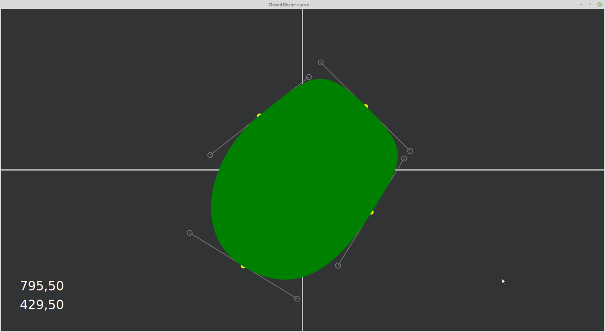

# Closed Bézier curves
A simple JavaFX application that shows the implementation of a closed (and animated) Bézier curve.

## Intro
I created this application because I needed to create a closed path with smoothly changing gradients. The Bézier curves
change smoothly but are open, so I had to make some adjustments to make their ends link seamlessly.

The trick of perfectly linking two Bézier curves is to make sure that:
* the end point of the first curve is the same of the start point of the second one (_shown in yellow in the figure
 below_);
* the line connecting the last control point of the first line and the first control point of the second one passes
 through the common point of the two curves (_the control points and the lines are shown in grey in the figure below_). 

[Bézier curves at Wikipedia.org](https://en.wikipedia.org/wiki/B%C3%A9zier_curve)

## Requirements
* Java 13 (but can be run since Java 11)
* Maven

## Compile
`mvn compile`

## Run
`mvn javafx:run`

## TODOs
* Configurable parameters
* Some comments in the code...
